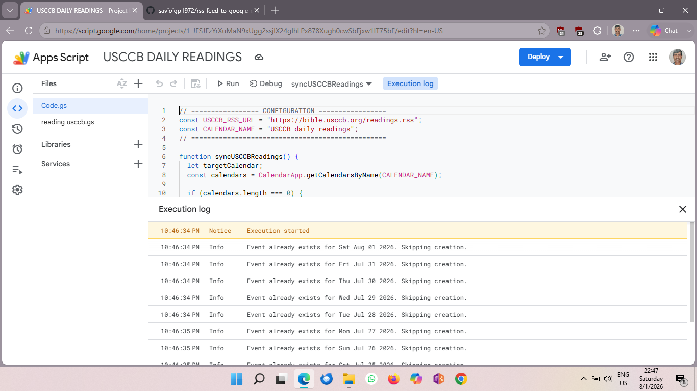

# 📖 USCCB Daily Readings RSS to Google Calendar 🗓️✨

An automated **Google Apps Script** ⚙️ that fetches daily Catholic Mass readings from the official **USCCB RSS feed** (`https://bible.usccb.org/readings.rss`) ✝️ and syncs them automatically into a dedicated Google Calendar! 📅

---

## 🌟 Awesome Features 🚀

* 📡 **Live RSS Sync:** Fetches daily Mass readings directly from the USCCB RSS feed! 📜
* 📆 **Dedicated Calendar:** Automatically creates and manages a isolated calendar named `"USCCB daily readings"`! 🧹
* 🛡️ **Smart Anti-Duplicate Protection:** Checks existing entries before adding new ones so your calendar never gets cluttered! 🛑
* ⏰ **Automated Daily Runs:** Set it once on a time-driven trigger and let it run on autopilot every morning! ☕
* 💡 **Clean & Lightweight:** Pure Apps Script execution with zero external library dependencies! ⚡

---

## 📸 Execution Log Preview 📊

Here is the script in action, verifying daily readings and skipping duplicates:



> **Note:** As seen in the log above, the script checks existing entries date-by-date and skips event creation if the reading already exists! 🛡️✨

---

## 🛠️ Code Configuration 🧠

```javascript
// ==================== CONFIGURATION ====================
const USCCB_RSS_URL = "[https://bible.usccb.org/readings.rss](https://bible.usccb.org/readings.rss)";
const CALENDAR_NAME = "USCCB daily readings";
// =======================================================
