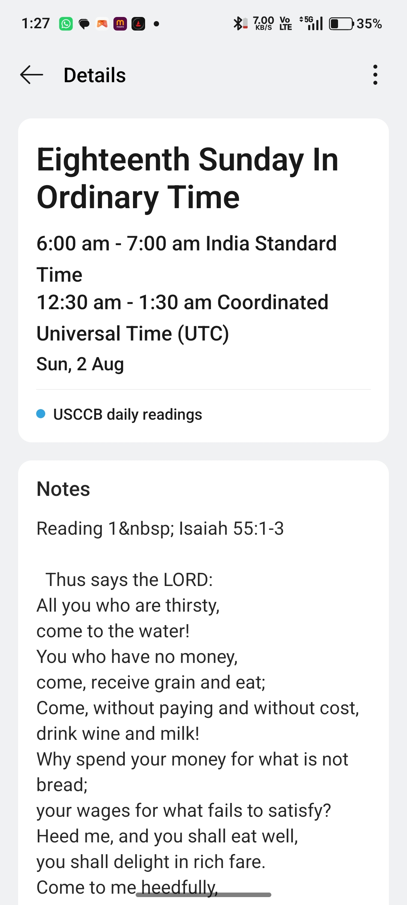
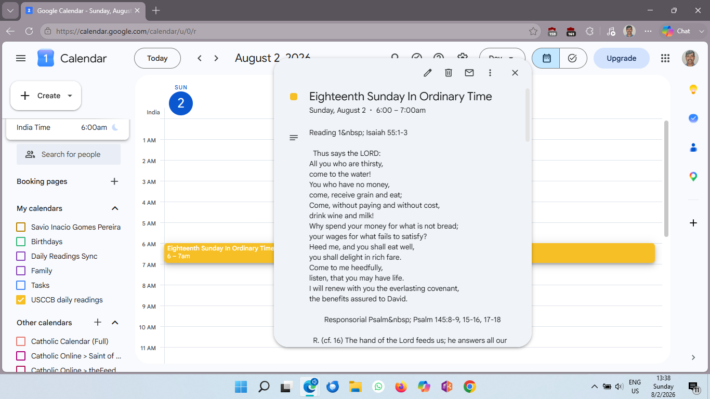

# 📡 RSS Feed to Google Calendar Sync 🗓️✨

> **A lightweight Google Apps Script to automatically sync custom RSS feeds (news, sports, hobbies, Catholic devotions, life hacks, and more) into Google Calendar.**

An automated, highly flexible **Google Apps Script** ⚙️ that parses any RSS or Atom feed and automatically posts feed entries as all-day or timed events into a dedicated Google Calendar! 📅

---

## 📂 Script Files 📁

Choose whichever script setup works best for you:

* **`Code.gs` (Option A):** Uses simple top-of-file constants. Best for a quick and direct setup!
* **`rss-to-calendar.js` (Option B):** Uses Google Apps Script `PropertiesService`. Best if you don't want to edit variables inside the script code!
* **`FEEDS.md`**: A curated list of ready-to-use RSS feeds across news, tech, sports, devotions, and life hacks.

---

## 🌟 Key Features 🚀

* 📡 **Universal RSS/Atom Support:** Syncs news, sports feeds, daily devotions, tech updates, blogs, or custom feeds directly to your calendar!
* 📅 **Flexible Event Types:** Supports creating **All-Day Events** or scheduled timed events.
* 🌐 **User-Agent Header Support:** Sends proper browser headers to prevent external servers from blocking feed requests.
* 🛡️ **Smart Anti-Duplicate Protection:** Checks existing entries before creating new ones to keep your calendar neat and uncluttered.
* ⏰ **Hands-Free Automation:** Runs on autopilot using Google Apps Script time-driven triggers.
* 🧼 **Clean Formatting:** Automatically strips raw HTML tags and formatting from feed descriptions so event notes stay easy to read.

---
## 📸 Screenshots & Previews 📊

### 📱 Oppo Calendar Event Preview
Here is how an aggregated RSS entry (such as USCCB Daily Readings) looks inside the Oppo Calendar app with clean formatting in the **Notes** section:



---

### 🖥️ Google Calendar Desktop Web View
Synced RSS feed items (USCCB Daily Mass Readings) displayed directly on the Google Calendar desktop web interface:



> **Note:** The script verifies existing calendar entries first to prevent double-booking or cluttered schedules! 🛡️✨
## 📸 Execution Log Preview 📊

Here is the script in action, verifying feed entries date-by-date and skipping duplicates:


> **Note:** The script verifies existing calendar entries first to prevent double-booking or cluttered schedules! 🛡️✨

---

## 🛠️ Step-by-Step Setup Guide 🚀

Follow these straightforward steps to get your automated RSS feed sync running in under 5 minutes:

### Step 1: Open Google Apps Script 💻
1. Go to **[script.google.com](https://script.google.com)** and log in with your Google Account.
2. Click **+ New project** in the top left corner.
3. Rename the project at the top from *Untitled project* to **RSS Feed Calendar Sync**.

### Step 2: Choose Your Script Setup 📋

#### 🟢 Option A: Use `Code.gs` (Direct Constants)
1. Copy the code from **`Code.gs`** and paste it into your editor window.
2. Edit the top two lines directly in your code:
   ```javascript
   const FEED_URL = "[https://your-rss-feed-url.com/feed.xml](https://your-rss-feed-url.com/feed.xml)";
   const CALENDAR_NAME = "My Feed Calendar";

  #### 🔵 Option B: Use `rss-to-calendar.js` (Script Properties)

1. Copy the code from **`rss-to-calendar.js`** and paste it into your editor window.
2. Click the **Project Settings icon** ⚙️ *(gear icon on the left navigation bar)*.
3. Scroll down to the **Script Properties** section.
4. Click **Add script property** and enter:
   * **Property:** `CALENDAR_NAME` | **Value:** `My Feed Calendar`
   * **Property:** `FEED_URL` | **Value:** `https://your-rss-feed-url.com/feed.xml`
5. Click **Save script properties** 💾.

> 💡 **Need sample feeds to test?** Check out our [`FEEDS.md`](FEEDS.md) file for a curated list of ready-to-use RSS URLs across news, tech, devotions, sports, and life hacks!

---

### Step 3: First Test Run & Authorize 🔑

1. Click the **Editor icon** `< >` on the left bar to return to your code.
2. In the top toolbar dropdown menu next to **Debug**, select `syncFeedToCalendar` (or `syncUSCCBReadings`).
3. Click **Run** 🟢.
4. An **"Authorization required"** prompt will appear:
   * Click **Review permissions**.
   * Select your Google Account.
   * Click **Advanced** $\rightarrow$ click **Go to RSS Feed Calendar Sync (unsafe)**.
   * Click **Allow** to grant access to Google Calendar and UrlFetchApp.
5. Check the **Execution log** at the bottom to verify successful syncing!

---

### Step 4: Automate Daily Execution ⏰

To have Google sync your RSS feed automatically every morning:

1. Click the **Triggers icon** ⏰ *(alarm clock on the left sidebar)*.
2. Click **+ Add Trigger** (blue button in the bottom right corner).
3. Set the configuration:
   * **Choose which function to run:** `syncFeedToCalendar` *(or your main sync function)*
   * **Select event source:** `Time-driven`
   * **Select type of time based trigger:** `Day timer`
   * **Select time of day:** Choose your preferred daily time (e.g., `5am to 6am`) ☕
4. Click **Save** 💾!

---

## 📂 Ready-to-Use Feed Directory (`FEEDS.md`) 📜

Check out the included **[`FEEDS.md`](FEEDS.md)** file in this repository for a collection of popular RSS feeds you can plug directly into your script settings, including:

* ✝️ Daily Mass Readings & Devotions
* 📰 World & Local News
* 💻 Tech & Programming Updates
* ⚽ Sports Schedules & News
* 💡 Life Hacks & Productivity

---

## 📜 License 📄

Distributed under the **MIT License** ⚖️. Free for personal, open-source, or community use! 🤝🎉
